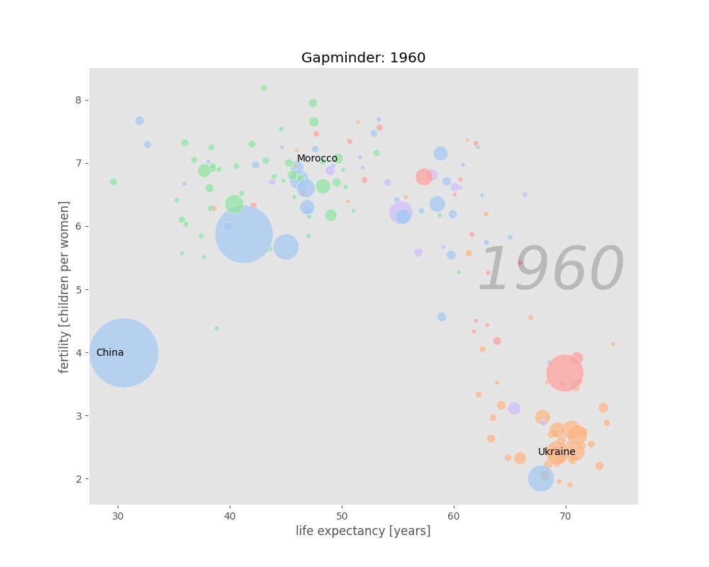

# Gapminder

The Gapminder Project leverages data from the Gapminder dataset, which includes socio-economic and demographic indicators. The primary focus of this project is to analyze how fertility rates, GDP, life expectancy, and population figures vary across different countries and continents over time. 

